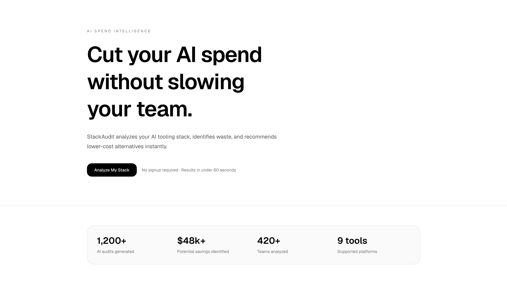
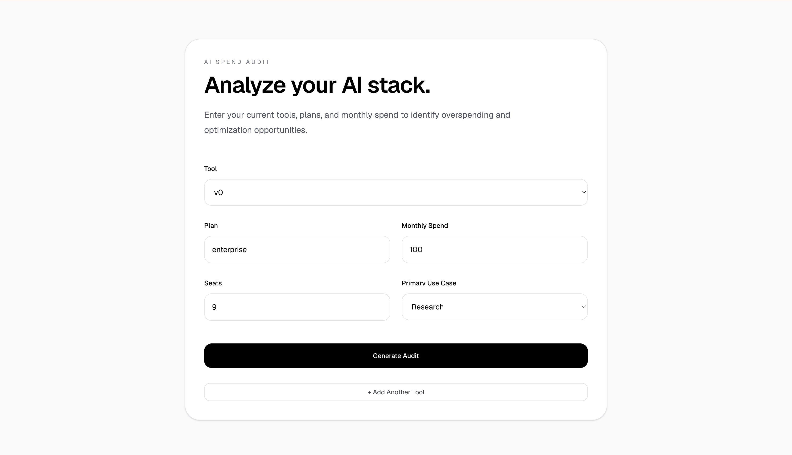
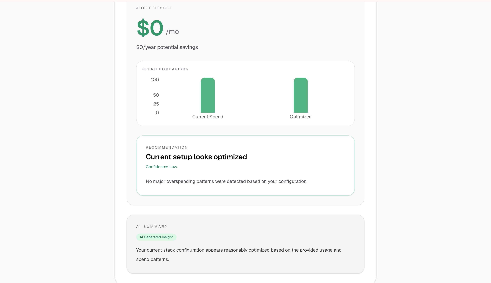

# StackAudit

AI spend optimization platform that helps teams identify overspending across AI tooling stacks.

## Live Demo

https://stackaudit-ivory.vercel.app

## Features

- AI stack auditing
- Savings recommendations
- Spend comparison charts
- AI-generated insights
- Multi-tool support planning
- Responsive SaaS UI

## Tech Stack

- Next.js
- TypeScript
- Tailwind CSS
- Recharts
- Vercel

## Screenshots

### Homepage



### Audit Form



### Audit Result



## Getting Started

```bash
npm install
npm run dev
```
